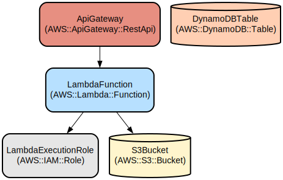

# WISP CRM: A Comprehensive Customer and Billing Management System for ISPs

WISP CRM is a robust customer relationship management system designed specifically for Wireless Internet Service Providers (WISPs). It streamlines customer management, billing, and service operations through an intuitive web interface while providing powerful automation capabilities for invoicing and notifications.

The system provides a complete solution for managing ISP operations including customer accounts, service plans, billing cycles, and technical support tickets. Key features include automated monthly invoice generation, multi-channel customer notifications via WhatsApp and email, integrated payment processing, and comprehensive reporting. The platform leverages modern web technologies and cloud services to deliver a scalable and reliable solution that helps ISPs efficiently manage their growing customer base.

## Repository Structure
```
.
├── src/main/java/org/wispcrm/          # Core application code
│   ├── controller/                      # MVC controllers for web endpoints
│   │   ├── ClienteController.java       # Customer management endpoints
│   │   ├── FacturaController.java       # Invoice management endpoints
│   │   ├── OrdenController.java         # Service order endpoints
│   │   └── PlanController.java          # Service plan endpoints
│   ├── services/                        # Business logic services
│   │   ├── EmailService.java            # Email notification service
│   │   ├── WhatsappMessageService.java  # WhatsApp notification service
│   │   └── FacturaServiceImpl.java      # Invoice generation service
│   ├── daos/                           # Data access layer
│   ├── interfaces/                     # Service interfaces
│   └── excepciones/                    # Exception handling
├── src/main/resources/
│   ├── static/                         # Static web assets
│   │   ├── dist/                       # Compiled assets
│   │   └── plugins/                    # Third-party plugins
│   └── templates/                      # HTML templates
```

## Usage Instructions

### Prerequisites
- Java 8 or higher
- MySQL/MariaDB database
- Maven for building
- AWS credentials for S3 integration
- UltraMsg API token for WhatsApp integration

### Installation

1. Clone the repository:
```bash
git clone <repository-url>
cd wisp-crm
```

2. Configure database connection in application.properties:
```properties
spring.datasource.url=jdbc:mysql://localhost:3306/wispcrm
spring.datasource.username=<username>
spring.datasource.password=<password>
```

3. Build the application:
```bash
mvn clean install
```

### Quick Start

1. Start the application:
```bash
java -jar target/wisp-crm.jar
```

2. Access the web interface at http://localhost:8080

3. Log in with default admin credentials:
- Username: admin
- Password: admin123

### More Detailed Examples

#### Managing Customers
```java
// Create new customer
POST /cliente/crear
{
    "nombre": "John Doe",
    "email": "john@example.com",
    "plan": "Basic Internet",
    "direccion": "123 Main St"
}

// Generate invoice
POST /factura/generar/{clienteId}
```

#### Sending Notifications
```java
// Send WhatsApp message
whatsappMessageService.sendSimpleMessage(
    clientNumber,
    "Your invoice #123 is ready"
);

// Send email notification
emailService.sendMail(factura);
```

### Troubleshooting

#### Common Issues

1. Database Connection Errors
- Error: "Could not connect to database"
- Solution: 
  ```bash
  # Check database service
  systemctl status mysql
  # Verify credentials in application.properties
  ```

2. WhatsApp Integration Issues
- Error: "Failed to send WhatsApp message"
- Check UltraMsg API token in configuration
- Verify client phone number format (+[country][number])

3. Invoice Generation Failures
- Enable debug logging:
  ```properties
  logging.level.org.wispcrm=DEBUG
  ```
- Check logs at /var/log/wispcrm/application.log

## Data Flow

The system processes customer data and billing information through several key components to manage the ISP service lifecycle.

```ascii
[Client Request] -> [Controller Layer]
       ↓                    ↓
[Service Layer] <- [Data Access Layer]
       ↓                    ↓
[External Services] <- [Database]
(Email/WhatsApp)
```

Key component interactions:
1. Controllers receive HTTP requests and delegate to appropriate services
2. Services implement business logic and coordinate data access
3. DAOs handle database operations using JPA/Hibernate
4. External services manage notifications via email and WhatsApp
5. Scheduled tasks handle automated billing and notifications
6. Security layer manages authentication and authorization
7. Exception handlers provide consistent error responses
8. Templates render dynamic web content

## Infrastructure



### Lambda Functions
- `FacturacionProgramada`: Scheduled invoice generation
- `NotificacionService`: Customer notification dispatcher

### Database Resources
- MySQL RDS instance for customer and billing data
- Tables: clientes, facturas, ordenes, planes

### Storage
- S3 bucket for invoice PDF storage
- CloudFront distribution for static assets

### External Services
- AWS SES for email delivery
- UltraMsg API for WhatsApp messaging
- AWS CloudWatch for monitoring

## Deployment

### Prerequisites
- AWS account with appropriate IAM roles
- Domain name and SSL certificate
- CI/CD pipeline configuration

### Deployment Steps
1. Build application package
2. Deploy database migrations
3. Upload static assets to S3
4. Deploy application to target environment
5. Configure monitoring and alerts